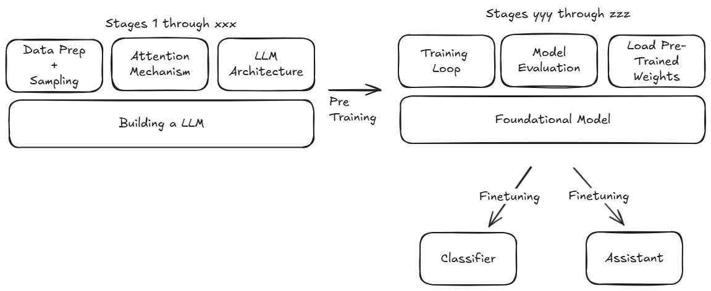
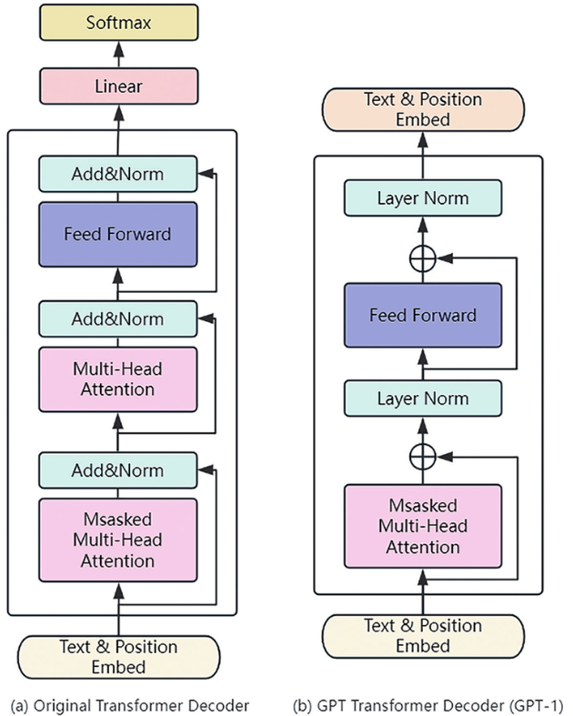

# LLM de 0

LLM from scratch ("de zero") is yet another build your own LLM.  
How does it defer from others? It does not use ANY lib..... all is done from scratch...
The easiest and most painful way to learn LLMs... but arguably the best way.

As this tutorial deals with text, I still went with [Python](https://www.python.org/), the easiest language to handle text (or is it [Perl](https://www.perl.org/)?).

Amazing other tutorials:

- [Building LLMs from scratch: Series introduction](https://www.youtube.com/watch?v=Xpr8D6LeAtw&list=WL&index=1) - the one I am following and transducting here
- [Andrej Karpathy](https://www.youtube.com/@AndrejKarpathy)
- [Build a Large Language Model (From Scratch)](https://www.google.fr/books/edition/Build_a_Large_Language_Model_From_Scratc/scIgEQAAQBAJ?hl=en&gbpv=0)

## LLM Large Language Model De Zero



- LLMs are Neural Networks design to "understand", generate and "respond" to input text - they are "large" because the number of parameters are high, 117 million for GPT-1, 1.5 billion for GPT-2 and 175 billion for GPT-3 or check this for [Gemini](https://en.wikipedia.org/wiki/Gemini_(language_model))
- [Neural Networks](https://en.wikipedia.org/wiki/Neural_network_%28machine_learning%29) train on massive amount of data - and they are really at capturing statistical relationships
- LLM have become so good thanks to the [Transformer Architecture](https://proceedings.neurips.cc/paper_files/paper/2017/file/3f5ee243547dee91fbd053c1c4a845aa-Paper.pdf). See also this [wiki entry](https://en.wikipedia.org/wiki/Transformer_(deep_learning_architecture))

## Pre-training and Fine-tuning

- Pre-training trains on a large data set (internet data....) ([Wikipedia](https://www.wikipedia.org/) has 3 billion tokens, [Common Crawl](https://commoncrawl.org/) filtered has 410 billion tokens...)
- Finetuning is about refining by training on narrower dataset- usually human-defined and domain specific (via labelled data)!

## Transformers

- It is a Deep Neural Network Architecture introduced by the paper "[Attention Is All You Need](https://proceedings.neurips.cc/paper_files/paper/2017/file/3f5ee243547dee91fbd053c1c4a845aa-Paper.pdf)", originally developed for translation tasks
- Steps in a transformer are:
    * TEXT: Input text
    * PRE-PROCESS: Pre-processing the text for the encoder (convert to numerical representation)
    * ENCODER: Produce text encodings used by the decoder
    * EMBEDDINGS: Encoder to return embedding vector as inputs to decoder - vectors allow conceptual groupings of words - semantic meaning is captured
    * ONE-WORD: Model completes one word as the time
    * PRE-PROCESS: Input text prepared for decoder
    * DECODER: Generates text one word at the time
    * OUTPUT: Final text 

### Self-attention

In the paper above, it is defined as "a mechanism to draw global dependencies between input and ouput", or to weigh the importance of different words / tokens relative to each other. It allows to capture long range dependencies.

# Implementation

## Stage 1: Data Preparation: Tokenizer
- Split text into words and sub-words tokens
- Convert tokens into token ids
- Encode ids into vectors

We will use [Tiny Shakespear](./data/TinyShakespeare.txt).

See [SimpleTokenizer](./code/simple_tokenizer.py):

```python
import re
class SimpleTokenizer:
    def __init__(self, vocab):
        self.str_to_int = vocab
        self.int_to_str = {v: k for k, v in vocab.items()}

    def encode(self, text):
        preprocesed = re.split(r'([,.:;?_!"()\']|--|\s)', text)
        preprocesed = [item.strip() for item in preprocesed if item.strip()]
        ids = [self.str_to_int[s] for s in preprocesed]
        return ids
    
    def decode(self, ids):
        text = " ".join([self.int_to_str[i] for i in ids])
        text = re.sub(r'\s([,.:;?_!"()\']|--)', r'\1', text)
        return text
```

Example:

```text
Text to encode: YOU ARE ALL RESOLVED RATHER TO DIE THAN TO FAMISH?
Encoded text: [11984, 516, 303, 8560, 8290, 10616, 2889, 10417, 10616, 3771, 9]
Decoded text: YOU ARE ALL RESOLVED RATHER TO DIE THAN TO FAMISH?
```

If we try to encoded an unknwon word, it will throw an error unless we add "special tokens" to take care of missing words, but also "end of text" tokens.

In [Scratch Book](./code/scratch_book.py), reading the vocab is done as, including the special tokens:

```python
import re

with open("./data/TinyShakespeare.txt", "r") as f:
    raw_text = f.read()
    raw_text = raw_text.upper()

preprocesed_text = re.split(r'([,.:;?_!"()\']|--|\s)', raw_text)
preprocesed_text = [item.strip() for item in preprocesed_text if item.strip()] 

all_words = sorted(set(preprocesed_text)) # 12002 tokens
all_words.extend(["<|EOT|>", "<|MIS|>"]) # Adding end-of-text and missing token markers, 12004 tokens, End Of Text and MISsing
vocab_size = len(all_words)

vocab = {token:integer for integer, token in enumerate(all_words)}
```

GPT uses Byte Pair Encoding...

## Stage 2: Data Preparation: Tokenizer using Byte Pair Encoding

Is BPE better than basic encoding?
Tokenizers exist in 3 different flavors, word based, sub-word based and character based:

- word based: "I love golf" -> "I", "love", "golf"
- sub-word based: "I love golf" -> "I", "lov", "e", "gol", "f"
- character based: "I love golf" -> "I", " ", "l", "o", "v", "e", " ", "g", "o", "l", "f"

In a nutshell:

- word based tokenizers have issues with missing vocabulary, or close words will have different ids such as "club" and "clubs"
- character based tokenizers have very small vocabulary size - usually equivalent to the number of characters in a given language. Its biggest issue is that meaning is lost.. because words are broken down into characters.
- sub-word is supposed to be the best of both worlds - [BPE](https://en.wikipedia.org/wiki/Byte-pair_encoding) is one sub-word algorithm

Sub-word tokenization follows the following rules:

- Do not split frequently used words into smaller sub-words
- Split the rare words into smaller, meaningful sub-words

"clubs" becomes "club" and "s"

[BPE](https://en.wikipedia.org/wiki/Byte-pair_encoding) ensures that most common words are represented as a single token.

Although the algoritm is fairly straightforward, we will use a library for testing BPE called [Tikoken](https://github.com/openai/tiktoken).

```python
import importlib.metadata
import tiktoken
print("tiktoken version:", importlib.metadata.version("tiktoken"))
bpe_tokenizer = tiktoken.get_encoding("gpt2")
bpe_encoded_text = bpe_tokenizer.encode(text_2_encode)
print("BPE encoded text:", bpe_encoded_text)
print("BPE decoded text:", bpe_tokenizer.decode(bpe_encoded_text))
```

## Stage 3: Data Preparation: Create Input-Target Pairs

Before we create vector embeddings we need to creat the input-target pairs.

Let's take the phrase: "I love golf and paddling".
The inputs-targets sequence is as:

- Input = "I", target = "love"
- Input = "I love", target = "golf"
- Input = "I love golf", target = "and"
- Input = "I love golf and", target = "paddling"

"Context length" is how many maximum input words you decide to work with.

```python
context_length = 4
x = raw_text_encoded[:context_length]
y = raw_text_encoded[1:context_length + 1]
print("Input (x):", x)
print("Target (y):", y)
for i in range(1, context_length + 1):
    context = raw_text_encoded[:i]
    target = raw_text_encoded[i]
    print(context, "-->", target)
    print(bpe_tokenizer.decode(context), "-->", bpe_tokenizer.decode([target]))
```

## Stage 4: Data Loaders
We will use [PyTorch](https://pytorch.org/) to efficiently create input-target pairs, using tensors.
A tensor is nothing more than a n-dimensional array or vector.
If the context length is 4, the x tensor will have a 4xn dimension, so will y:

Let's take the phrase: "I love golf and paddling":

```text
x = tensor([["I", "love", "golf", "and"],
            ["paddling", ...]])
y = tensor([["love", "golf", "and", "paddling"],
            ...])
```

x's "I" target is y's "love" - same index.
x's "I", "love" will have "golf" has target in y.

Each row represents one Input Context.

That's the idea.

This is the data set using the above concept:

```python
import torch
from torch.utils.data import Dataset, Dataloader

class TextDataset(Dataset):
    def __init__(self, txt, tokenizer, context_length, stride):
        self.input_ids = []
        self.target_ids = []

        token_ids = tokenizer.encode(txt, allowed_special={"<|endoftext|>"})

        for i in range(0, len(token_ids) - context_length, stride):
            input_chunk = token_ids[i : i + context_length]
            target_chunk = token_ids[i + 1 : i + context_length + 1]
            self.input_ids.append(torch.tensor(input_chunk))  
            self.target_ids.append(torch.tensor(target_chunk))
    
    def __len__(self):
        return len(self.input_ids)
    
    def __getitem__(self, idx):
        return self.input_ids[idx], self.target_ids[idx]
```

We then need to create a data loader.

```python
import torch
from torch.utils.data import Dataset, DataLoader

class TextDataset(Dataset):
    def __init__(self, txt, tokenizer, context_length, stride):
        self.input_ids = []
        self.target_ids = []

        token_ids = tokenizer.encode(txt, allowed_special={"<|endoftext|>"})

        for i in range(0, len(token_ids) - context_length, stride):
            input_chunk = token_ids[i : i + context_length]
            target_chunk = token_ids[i + 1 : i + context_length + 1]
            self.input_ids.append(torch.tensor(input_chunk))  
            self.target_ids.append(torch.tensor(target_chunk))
    
    def __len__(self):
        return len(self.input_ids)
    
    def __getitem__(self, idx):
        return self.input_ids[idx], self.target_ids[idx]
    
# Create a DataLoader for the TextDataset
# Parameters: 
# - raw_txt: the raw text to be tokenized
# - batch_size: size of each batch 
# - context_length: maximum length of the input sequence
# - stride: step size to move the input data by
# - shuffle: whether to shuffle the dataset
# - drop_last: whether to drop the last incomplete batch
# - num_workers: number of subprocesses to use for data loading
def create_dataloader(raw_txt, batch_size=4, context_length=256, stride=128, shuffle=True, drop_last=True, num_workers=0):
    from tiktoken import get_encoding
    tokenizer = get_encoding("gpt2")
    
    dataset = TextDataset(raw_txt, tokenizer, context_length, stride)
    
    dataloader = DataLoader(
        dataset,
        batch_size=batch_size,
        shuffle=shuffle,
        drop_last=drop_last,
        num_workers=num_workers
    )
    
    return dataloader
```

Test:

```python
from data_loader import create_dataloader
data_loader = create_dataloader(raw_text, batch_size=1, context_length=4, stride=128, shuffle=True, drop_last=True, num_workers=0)
data_iter = iter(data_loader)
first_batch = next(data_iter)
print("First batch input IDs:", first_batch)
```

Output:

- The first tensor is the input, the second tensor is the target

```text
First batch input IDs: [tensor([[    6,    50, 33478,  7283]]), tensor([[   50, 33478,  7283,  6226]])]
```

To remember:

- "stride" moves the input field by x, if stride = 1, the next token is moved by 1, etc. Might prevent over-fitting if > 1 by reducing overlaps

## Stage 5: Token embeddings

We went from raw text, to tokenized data, to token ids, and the creation of tensors (vectors) with inputs and targets.
Embeddings are what are fed into the neural network.

What are embeddings? Computers do not understand words, they understand numbers.
Random numbers (token ids) assignment to words does not work because it does not capture how words are related to each other.

Similar words need to have similar "vectors" that are in the same "space" (direction, points towards the same direction).
Vectors are multi-dimentional, the more features, the higher the vector's dimension.

How to create such vectors? Via Neural Networks...

Companies like Google have open-sourced pre-trained vectors. For example, [Google's word2vec](https://code.google.com/archive/p/word2vec/), or [here](https://huggingface.co/fse/word2vec-google-news-300) are available for anyone to use.

At this stage, you realize that "build an LLM from scratch" is not really from scratch due to the pre-processing required...

word2vec-google-news-300 contains the number 300 which is the dimension of the vectors.... 


```python
import gensim.downloader as api

model = api.load("word2vec-google-news-300")

word_vectors = model

print(f"Vector for 'computer': {word_vectors['computer']}") 

print(f"Similaraties between man and woman': {word_vectors.similarity('man', 'woman')}")
```

Outputs:

```text
Vector for 'computer': [ 1.07421875e-01 -2.01171875e-01  1.23046875e-01  2.11914062e-01
 -9.13085938e-02  2.16796875e-01 -1.31835938e-01  8.30078125e-02 ..... 300 times

Similaraties between man and woman': 0.7664012312889099 .... the highest the most similar
```

We need to construct an embedding weight matrix that has a size of (vector dimension by vocabulary size).  
So if the vector size is n and the vocabulary size is m, the matrix size is n * m.  
For example, GPT-2 used vectors of 768 dimension size with a vocabulary size of 50,257 (token ids), there are therefore 38,597,376 elements in the matrix.

How is this matrix created? First by initialising the matrix elements with random values, and train a model using the embeddings as targets.  
Using backpropagation, the weights of the matrix are udpdated.

Here is an example of creating such a matrix, initialised with random weights:

```python
# Token Embeddings
print("\nCreating Token Embeddings")

import torch

# I  love golf a  lot  -- raw text - vocab size is 5 
# 2, 3,   4,   5, 1    -- token ids  
input_ids = torch.tensor([2, 3, 4])  # I  love golf

vocab_size = 5
feature_size = 3 # for example - GPT-2 has 768 features 

torch.manual_seed(42)  # For reproducibility

embedding_layer = torch.nn.Embedding(vocab_size, feature_size)
print(f"Embedding Layer Weights: {embedding_layer.weight}")
```

Ouputs:

```text
Creating Token Embeddings
Embedding Layer Weights: Parameter containing:
tensor([[ 0.3367,  0.1288,  0.2345],
        [ 0.2303, -1.1229, -0.1863],
        [ 2.2082, -0.6380,  0.4617],
        [ 0.2674,  0.5349,  0.8094],
        [ 1.1103, -1.6898, -0.9890]], requires_grad=True)
```

Notice its size is 5 x 3.

## Stage 6: Positional Embeddings

Previously, we have discussed the concept of embeddings, a way to capture similarities between words in a high-dimentional space.  
Consider the following two phrases:

1. I played golf on this fantastic course
2. On this fantastic course I played golf

"golf" appears twice (same token id), but at different locations. How to capture the location?
If we do not capture it, the resulting embedded vector representation will be identical.

There are two types of positional embeddings: absolute and relative.

Basically, a number (position) is added to the original embedding vector.

Absolute positioning is used when a fixed number of tokens is important such as sequence generation.  
Relative positioning is better when dealing with long sequences where the same phrase appears in different parts of the sequence.  

In the paper "[Attention Is All You Need](https://proceedings.neurips.cc/paper_files/paper/2017/file/3f5ee243547dee91fbd053c1c4a845aa-Paper.pdf), section 3.5 gives some formulas about how to compute positional embeddings.

## Stage 7: Inputs Embeddings

Inputs embeddings are the sum of token embeddings and positional embeddings.
In code:

```python
# Positional Embeddings
print("\nCreating Positional Embeddings")
vocab_size = 50257
feature_size = 256 
max_length = 4

embedding_layer = torch.nn.Embedding(vocab_size, feature_size)

from data_loader import create_dataloader
with open("./data/TinyShakespeare.txt", "r") as f:
    raw_text = f.read()
    raw_text = raw_text.upper()
data_loader = create_dataloader(raw_text, batch_size=8, context_length=max_length, stride=max_length, shuffle=False)
dara_iter = iter(data_loader)
inputs, targets = next(dara_iter)

print("Token IDs:", inputs)
print("Inputs shape:", inputs.shape)

token_embeddings = embedding_layer(inputs)
print("Token Embeddings shape:", token_embeddings.shape)

context_length = max_length
pos_embedding_layer = torch.nn.Embedding(context_length, feature_size)
pos_embedding = pos_embedding_layer(torch.arange(max_length))
print("Positional Embeddings shape:", pos_embedding.shape)

input_embeddings = token_embeddings + pos_embedding
print("Input Embeddings shape:", input_embeddings.shape)
```

At this stage we went through data processing from tokenization (BPE), token embeddings, positional embeddings to input embeddings.

Input embeddings are then fed to the neural network.

But before we need to look at "Attention mechanism"

## Stage 8: Attention mechanism

Attention is the most important concept to understand why GPT or Gemini function so well.  

Let's get a quick understanding of Attention.

Consider the phrase: "The cat sitting on the mat, next to the dog, jumped".

The LLM needs to understand that it is the cat who jumped.
The LLM needs to capture long term dependencies in sentences.

There are 4 types of attention mechanisms:

- Simplified Self-Attention
- Self-Attention
- Causal Attention
- Multi-Head Attention

The paper "[Attention Is All You Need](https://proceedings.neurips.cc/paper_files/paper/2017/file/3f5ee243547dee91fbd053c1c4a845aa-Paper.pdf)" (2017) is based on the research paper [Neural Machine Translation by Jointly Learning to Align and Translate](https://arxiv.org/pdf/1409.0473) by Dzmitry Bahdanau in 2014.

For a great virtual virtual representation, watch [Attention in transformers, step-by-step | DL6](https://www.youtube.com/watch?v=eMlx5fFNoYc).

### Simplified Self-Attention

The idea is to convert a word (token) vector embedding into a context vector - an enriched vector, with semantic meaning about that word but also how that word relates to other words in the phrase.

We will use the phrase from [Paul Valery](https://en.wikipedia.org/wiki/Paul_Val%C3%A9ry): 

"Les sanglots longs des violons"  

Each word $w_i$ will have a vector representation $x_i$.  
The idea is to compute a context vector $z_i$ for each word.  
To go from $x_i$ to $z_i$ we will compute attention weights $\alpha_j$.  

For example, for a phrase with n words, for $w_2$, we will compute $\alpha_{21}$, $\alpha_{22}$, ..., $\alpha_{2n}$   

See [scratch_book_4.py](./code/scratch_book_4.py)

The main issue with the Simplified Self-Attention approach is the fact that there is prior-biased between two vectors (already aligned) and might not actually capture the attention from the sentence.

### Simplified Self-Attention with Trainable Weights

For a great visual representation, check out this [video](https://www.youtube.com/watch?v=eMlx5fFNoYc).

Self-Attention with Trainable Weights uses Weight Matrices that are updated during model training.  

There are 3 weight matrices for this chapter: $W_q$, $W_k$ and $W_v$.
q stands for Query, k for Key and v for Value.

The idea is to convert Input Embeddings into Key, Query and Value vectors.

Let's get to the original phrase, Inputs = "Les sanglots longs des violons", asssuming 3 features per word, each row representing a word: les, sanglots, longs, des, violons: $A_i$ is a float number:

```math
Inputs (5x3) = \begin{bmatrix}A1 &A2 & A3\\A4 & A5 & A6\\A7 & A8 & A9\\A10 & A11 & A12\\A13 & A14 & A15 \end{bmatrix}
```

Assume 3 trained matrices $W_q$, $W_k$ and $W_v$.

```math
W_q (3x2) = \begin{bmatrix}Q1 & Q2\\Q3 & Q4\\Q5 & Q6 \end{bmatrix}
W_k (3x2) = \begin{bmatrix}K1 & K2\\K3 & K4\\K5 & K6 \end{bmatrix}
W_v (3x2) = \begin{bmatrix}V1 & V2\\V3 & V4\\V5 & V6 \end{bmatrix}
```

```math
Queries = Inputs * W_q (5x2) = \begin{bmatrix}Q'1 & Q'2\\Q'3 & Q'4\\Q'5 & Q'6\\Q'7 & Q'8\\Q'9 & Q'10 \end{bmatrix}

Keys = Inputs * W_k (5x2) = \begin{bmatrix}K'1 & K'2\\K'3 & K'4\\K'5 & K'6\\K'7 & K'8\\K'9 & K'10 \end{bmatrix}

Values = Inputs * W_v (5x2) = \begin{bmatrix}V'1 & V'2\\V'3 & V'4\\V'5 & V'6\\V'7 & V'8\\V'9 & V'10 \end{bmatrix}
```

Now we need to compute the attention score for each input.

Each Input ("les, sanglots, longs, des, violons") has now a (Q, K, V).

Assume we use the word "sanglots" as an example: we just need to multiply (dot product) the second row from the Queries matrix by the Keys Matrix transposed.
This gives a (2x5) matrix: $AttentionScore("sanglots")$ = $Queries[2]$ * $Keys^T$

Each number in the matrix represents the attention score for "sanglots" related to "les, sanglots, longs, des, violons"

To generalise this for all inputs, just do this: $AttentionScore (5x5)= Queries * Keys^T$

We need also to normalize this Attention Scores by squaring by the square root of 2 (2 is the x2 dimension of the matrices) then a softmax.

But why divide by $\sqrt{2}$? Softmax is sensitive to outliers - this helps normalize the scores before applying softmax.  
But why Square Root? Because the product of Q and K increases the variance, which grows proportional to the dimension, dividing by $\sqrt{dimension}$ keeps the variance close to 1.

Finally we need to computer the Context Vectors.

For this, just multiply the Attention Weights by the Values Matrix: $Context Vector (5x2) = AttentionScore (5x5) * W_v (5x2)$

In python:

```python
# Self-Attention V1 using Q, K, V

import torch
import torch.nn as nn

class SelfAttentionV1(nn.Module):
    def __init__(self, input_embedding_dimension, output_matrices_dimension):
        super().__init__()
        self.W_query = nn.Parameter(torch.randn(input_embedding_dimension, output_matrices_dimension))
        self.W_key = nn.Parameter(torch.randn(input_embedding_dimension, output_matrices_dimension))
        self.W_value = nn.Parameter(torch.randn(input_embedding_dimension, output_matrices_dimension))

    def forward(self, x):
        keys = x @self.W_key
        queries = x @self.W_query
        values = x @self.W_value

        attention_scores = queries @ keys.T
        attention_weights = torch.softmax(attention_scores / keys.shape[-1]**0.5, dim=-1)

        context_vectors = attention_weights @ values
        return context_vectors
    
```

- Think of Query as the Current Token
- Think of Key as the Inputs
- Think of Value as the Content representing the Inputs

$W_q$, $W_k$ and $W_v$ are computed as part of the LLM training, this will be seen later.

### Causal Self-Attention

Causal Self-Attention is also known as Masked Attention.
Whereas Self-Attention considers the entire tokens in the input sequence, Causal Self-Attention restricts the model to only consider previous and current inputs in a sequence when processing any given token: it is done by masking out future tokens in a sequence.

The attention score becomes a triangular matrix.

In Self-Attention, 

```math
Attention Score (5x5) = \begin{bmatrix}A1 & A2 & A3 & A4 & A5\\ A6 & A7 & A8 & A9 & A10\\A11 & A12 & A13 & A14 & A15\\A16 & A17 & A18 & A19 & A20\\A21 & A22 & A23 & A24 & A25 \end{bmatrix}
```

becomes in Causal Self-Attention:

```math
\begin{bmatrix}A1 &  &  &  & \\ A6 & A7 &  &  & \\A11 & A12 & A13 &  & \\A16 & A17 & A18 & A19 & \\ A21 & A22 & A23 & A24 & A25\end{bmatrix}.
``` 
if the context size is 5
In code:

```python
class CausalSelfAttention(nn.Module):
    def __init__(self, input_embedding_dimension, output_matrices_dimension):
        super().__init__()
        self.W_query = nn.Linear(input_embedding_dimension, output_matrices_dimension, bias=False)
        self.W_key = nn.Linear(input_embedding_dimension, output_matrices_dimension, bias=False)
        self.W_value = nn.Linear(input_embedding_dimension, output_matrices_dimension, bias=False)

    def forward(self, x):
        keys = self.W_key(x)
        queries = self.W_query(x)
        values = self.W_value(x)

        attention_scores = queries @ keys.T

        ctx_length = attention_scores.shape[0]
        mask = torch.triu(torch.ones(ctx_length, ctx_length), diagonal=1)
        masked = attention_scores.masked_fill(mask.bool(), float('-inf'))

        attention_weights = torch.softmax(masked / keys.shape[-1]**0.5, dim=-1)

        context_vectors = attention_weights @ values
        return context_vectors
```

### Multi-Head Attention

Multi-Head Attention extends Causal Attention to work on multiple heads ($W_q$, $W_k$ and $W_v$) simultaneously, then combine their weights.
Ie., ($W_{q1}$, $W_{k1}$ and $W_{v1}$) and ($W_{q2}$, $W_{k2}$ and $W_{v2}$) for ex.

Combining here means increasing the size of the 2 context matrices, going for ex from 5x2 twice to a matrix of size 5x4.

In code, implementing Multi-Head Attention involves the creation of multiple instances of the Self-Attention Mechanism, combining their outputs.

```python
class MultiheadAttentionWrapper(nn.Module):
    def __init__(self, d_in, d_out, context_length, droput, num_heads, qkv_bias=False):
        super().__init__()
        self.heads = nn.ModuleList([
            CausalSelfAttentionWithDropouts(d_in, d_out, context_length, droput, qkv_bias)
            for _ in range(num_heads)
        ])

    def forward(self, x):
        return torch.cat([head(x) for head in self.heads], dim=-1)
```

GPT uses 96 Attention Heads... this is a lot of matrix multiplications!

### Multi-Head Attention Efficiency

In the previous implementation, we performed two matrices multiplication... for a multi-head attention size of 96 like GPT3, that is not very efficient.

Before:

Assume $Inputs_X$, then two weight matrices $W_{q1}$ and $W_{q2}$ with a column size of 2, after matrix multiplication, we end up with $Q_1$ and $Q_2$ with the same number of columns.

What about:

$Inputs_X$ and just one weight matrix of size 4 $W_q$, then via just one multiplication we obtain $Q$ and then we split $Q$ into $Q_1$ and $Q_2$ with column sizes of 2.

#### MultiheadAttention Forward Method Step-By-Step 1: Inputs

Let's start with an $Input$ - there are 3 dimensions: b the number of batches, the number of tokens and the input dimension (dimension of vector embedding)
For example:

```text
Input_X = tensor(
    [[[1.7623, 1.4337, 1.2000, 1.2000, 1.5703, 1.2],   # Representation vector for word 1
      [1.4337, 1.4337, 0.8493, 0.8493, 1.5010, 1.32],   # Representation vector for word 2
      [1.2000, 0.8493, 1.2436, 1.2436, 1.0863, 1.45]]]) # Representation vector for word 3
```
- b = 1
- num_tokens = 3
- input_dimension = 6

#### MultiheadAttention Forward Method Step-By-Step 2: d_out and num_heads

What is the output dimension d_out and the number of heads, num_heads.
We are deciding that the output dimension (context vector) is the same as the input dimension and the number of heads to be 2 (GPT3 uses 96!).

- d_out = 6
- num_heads = 2
- head_dim = d_out / num_heads = 6 / 2 = 3

#### MultiheadAttention Forward Method Step-By-Step 3: Initialise weight matrices

Init $W_k$, $W_q$ and $W_v$ with a dimension of 6x6 = d_in * d_out randomly.

#### MultiheadAttention Forward Method Step-By-Step 4: Calculate K, Q, V

$K = Input * W_k$, $Q = Input * W_q$ and $V = Input * W_v$

$Input$ is of dimension (1, 3, 6), $Ws$ is of dimension (6, 6), $K$ is of dimension (1, 3, 6), so are $Q$ and $V$

#### MultiheadAttention Forward Method Step-By-Step 5: 4th dimension to K, Q, V

Include num_heads and head_dim.

- head_dim = d_out / num_heads = 6 / 2 = 3

So that (b, num_tokens, d_out) becomes (b, num_tokens, num_heads, head_dim) or (1, 3, 6) becomes (1, 3, 2, 3).

#### MultiheadAttention Forward Method Step-By-Step 6: Group the matrices by num_heads

So that (b, num_tokens, num_heads, head_dim) becomes (b, num_heads, num_tokens, head_dim) or (1, 2, 3, 3).  
This is done by transposing the matrix.

#### MultiheadAttention Forward Method Step-By-Step 7: Compute Attention Scores

It is basically $Queries * Keys.Transpose(2, 3)$

#### MultiheadAttention Forward Method Step-By-Step 8: Mask attention score to implement Causal Attention

This is about replacing the upper triangle of the matrix with -infinity and divide by sqrt(head_dim) (3 in our case)
Then we apply softmax.
Finally, implement dropout.

#### MultiheadAttention Forward Method Step-By-Step 9: Calculation of the context vectors

$Context Vector = AttentionWeights(b, num\_heads, num\_tokens, num\_tokens) * Values(b, num\_heads, num\_tokens, num\_tokens)$

#### MultiheadAttention Forward Method Step-By-Step 10: Reformat the context vectors

We need to (re)transpose again to go from (b, num_heads, num_tokens, head_dim) to (b, num_tokens, num_heads, head_dim).

#### MultiheadAttention Forward Method Step-By-Step 11: Combine all heads

This basically is done via flattening each token output into each row so that the resulting dimension is (b, num_tokens, d_out) or (1,3, 6) in our case.

```python
class MultiHeadAttention(nn.Module):
    def __init__(self, d_in, d_out, context_length, dropout, num_heads, qkv_bias=False):
        super().__init__()
        assert (d_out % num_heads == 0), \
            "d_out must be divisible by num_heads"

        self.d_out = d_out
        self.num_heads = num_heads
        self.head_dim = d_out // num_heads # Reduce the projection dim to match desired output dim

        self.W_query = nn.Linear(d_in, d_out, bias=qkv_bias)
        self.W_key = nn.Linear(d_in, d_out, bias=qkv_bias)
        self.W_value = nn.Linear(d_in, d_out, bias=qkv_bias)
        self.out_proj = nn.Linear(d_out, d_out)  # Linear layer to combine head outputs
        self.dropout = nn.Dropout(dropout)
        self.register_buffer(
            "mask",
            torch.triu(torch.ones(context_length, context_length),
                       diagonal=1)
        )

    def forward(self, x):
        b, num_tokens, d_in = x.shape

        keys = self.W_key(x) # Shape: (b, num_tokens, d_out)
        queries = self.W_query(x)
        values = self.W_value(x)

        # We implicitly split the matrix by adding a `num_heads` dimension
        # Unroll last dim: (b, num_tokens, d_out) -> (b, num_tokens, num_heads, head_dim)
        keys = keys.view(b, num_tokens, self.num_heads, self.head_dim) 
        values = values.view(b, num_tokens, self.num_heads, self.head_dim)
        queries = queries.view(b, num_tokens, self.num_heads, self.head_dim)

        # Transpose: (b, num_tokens, num_heads, head_dim) -> (b, num_heads, num_tokens, head_dim)
        keys = keys.transpose(1, 2)
        queries = queries.transpose(1, 2)
        values = values.transpose(1, 2)

        # Compute scaled dot-product attention (aka self-attention) with a causal mask
        attn_scores = queries @ keys.transpose(2, 3)  # Dot product for each head

        # Original mask truncated to the number of tokens and converted to boolean
        mask_bool = self.mask.bool()[:num_tokens, :num_tokens]

        # Use the mask to fill attention scores
        attn_scores.masked_fill_(mask_bool, -torch.inf)
        
        attn_weights = torch.softmax(attn_scores / keys.shape[-1]**0.5, dim=-1)
        attn_weights = self.dropout(attn_weights)

        # Shape: (b, num_tokens, num_heads, head_dim)
        context_vec = (attn_weights @ values).transpose(1, 2) 
        
        # Combine heads, where self.d_out = self.num_heads * self.head_dim
        context_vec = context_vec.contiguous().view(b, num_tokens, self.d_out)
        context_vec = self.out_proj(context_vec) # optional projection

        return context_vec
```

## Stage 9: LLM Architecture

We went through text, tokenized text, embeddings, multi-head attention to create context vectors.
(Masked) multi-head attention are part of what is called "Transformer Block"
We will use GPT-2's architecture from now one.
Read this great [medium article](https://medium.com/@vipul.koti333/from-theory-to-code-step-by-step-implementation-and-code-breakdown-of-gpt-2-model-7bde8d5cecda)

See [LLM Architecture](./code/llm_arch.py) and [Scratch Book](./code/llm_scratch_book_1.py)

### Normalisation layer

Speficially, we are looking at the various layers in the transformer architecture:
(from this [source](https://www.researchgate.net/figure/the-foundational-architecture-of-GPT-series-models_fig1_376740720))



Starting with the normalisation layer, which improves the stability and the effiency of the network training, by adjusting the outputs to have a mean of zero and variance of one (calculate the mean $M$ of the vector , calculate is variance $var$, normalize by calculating $(x_i-M)/\sqrt{var}$).

In python:

```python
class LayerNorm(nn.Module):
    def __init__(self, emb_dim):
        super().__init__()
        self.eps = 1e-5 # to avoid division  by 0
        self.scale = nn.Parameter(torch.ones(emb_dim))
        self.shift = nn.Parameter(torch.zeros(emb_dim))

    def forward(self, x):
        mean = x.mean(dim=-1, keepdim=True)
        var = x.var(dim=-1, keepdim=True, unbiased=False)
        norm_x = (x - mean) / torch.sqrt(var + self.eps)
        return norm_x * self.scale + self.shift
```

### GELU Activation

Please read [this](https://en.wikipedia.org/wiki/Rectifier_(neural_networks)#Gaussian-error_linear_unit_(GELU)).

Maths-wise, $GELU(x) = x * \Phi(x)$ where $\Phi$ is the Cumulative Distribution Function of the Standard Gaussian Distribution.

An approximation used in GPT-2:

$GELU(x) ~= 0.5 * x * (1 + tanh(\sqrt{2/\Pi} * (x + 0.044715 * x^3)))$

In python:

```python
class GELU(nn.Module):
    def forward(self, x):
        return x * 0.5 * (1.0 + torch.tanh(
            (2.0 / torch.pi) ** 0.5 * (x + 0.044715 * x.pow(3))
        ))
```

### Feed Forward

```python
class FeedForward(nn.Module):
    def __init__(self, cfg):
        super().__init__()
        self.layers = nn.Sequential(
            nn.Linear(cfg["emb_dim"], 4 * cfg["emb_dim"]),
            GELU(),
            nn.Linear(4 * cfg["emb_dim"], cfg["emb_dim"])
        )

    def forward(self, x):
        return self.layers(x)
    
    def __repr__(self):
        return "FeedForward()"
```

### Shortcuts

In the diagram above, it is the "+" sign: when we go from the embeddings into the normalisation bypassing the attention layer or the feed forward layer.
Shortcut connections are also known a "skip" or "residual" connections.

In the backward pass, when weights of the neural network become small, it is very difficult to make learning progress.

Shortcut is therefore a way to skip a neural network layer.

Also read [Visualizing the Loss Landscape of Neural Nets](https://arxiv.org/abs/1712.09913).

